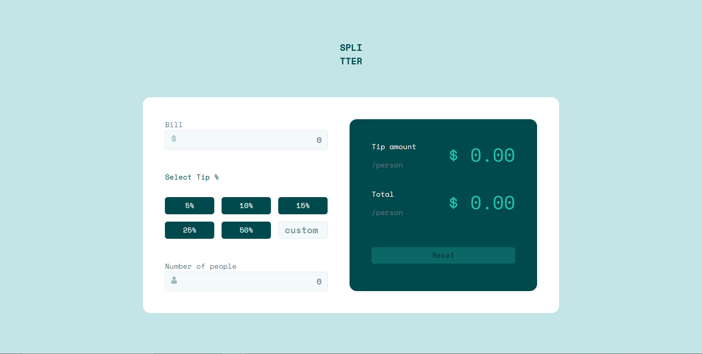
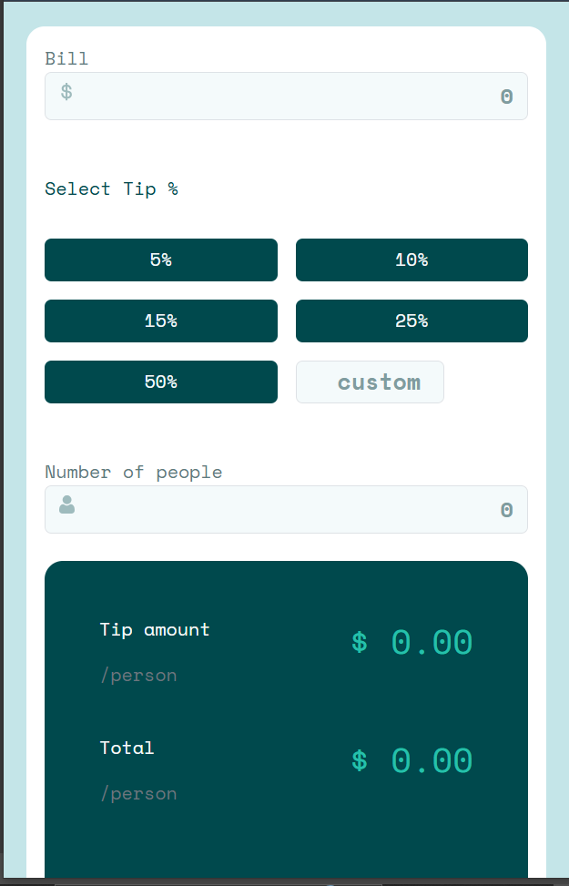

# Frontend Mentor - Tip Calculator App Solution

This is a solution to the [Tip calculator app challenge on Frontend Mentor](https://www.frontendmentor.io/challenges/tip-calculator-app-ugJNGbJUX). Frontend Mentor challenges help you improve your coding skills by building realistic projects.

## Table of contents

- [Overview](#overview)
  - [The challenge](#the-challenge)
  - [Screenshot](#screenshot)
  - [Links](#links)
- [My process](#my-process)
  - [Built with](#built-with)
  - [What I learned](#what-i-learned)
- [Author](#author)

## Overview

### The challenge

Users should be able to:

- View the optimal layout for the app depending on their device's screen size
- See hover states for all interactive elements on the page
- Calculate the correct tip and total cost of the bill per person

### Screenshot




### Links

- Solution URL: [Add your GitHub repo link here](https://github.com/Amro6779/Tip-Calculator-App)
- Live Site URL: [Add your live site link here](https://amro6779.github.io/Tip-Calculator-App/)

## My process

### Built with

- Semantic HTML5 markup
- CSS custom properties (custom color palette variables)
- [Bootstrap 5](https://getbootstrap.com/) - for the grid system, form styling, and validation utility classes
- Flexbox
- Mobile-first responsive workflow
- Vanilla JavaScript (DOM manipulation, no frameworks)

### What I learned

This project focused heavily on handling live user input and getting the calculation logic exactly right, which surfaced a lot of small but important JavaScript details.

**`input.value` is always a string**

Reading values straight from form fields and using them in arithmetic caused unexpected bugs. `+` between a string and a number performs concatenation instead of addition, while `*` and `/` coerce strings to numbers automatically:

```js
"142.50" + 4.28   // "142.504.28" (string concatenation)
"142.50" * 2      // 285 (works, JS coerces to a number)
```

The fix was to explicitly convert input values with `Number()` before using them in any addition:

```js
let totalPerPerson = (Number(billInput.value) + tipTotal) / numberOfPeople.value;
```

**`parseFloat()` vs `Number()` for values with symbols**

Reading a tip percentage directly from a button's text (`"15%"`) with `Number()` returns `NaN`, since the `%` character makes the whole string invalid as a number. `parseFloat()` reads from the start of the string and stops at the first non-numeric character, which handles this cleanly:

```js
Number("15%")      // NaN
parseFloat("15%")  // 15
```

**Recalculating on every input, not just on submit**

Since there's no "Calculate" button, every relevant input (`bill`, `tip %`, `number of people`, `custom tip`) needed its own `input` event listener, all calling the same `calculateTipAmount()` function so the result updates live.

**Keeping calculation logic separate from state updates**

Early on, I tried to update `tipPercent` inside the shared `calculateTipAmount()` function itself, which caused a bug: clicking a tip button and then having the (empty) custom input's logic run inside the same function reset the percentage back to 0. The fix was to only update `tipPercent` inside each specific event handler (the button's click, or the custom input's own listener) and let `calculateTipAmount()` do nothing but read the current `tipPercent` and calculate/display the result.

**Guarding against division by zero**

When `numberOfPeople` is empty or 0, dividing by it produces `NaN` or `Infinity`. Adding an early check at the top of `calculateTipAmount()` that displays `$0.00` and `return`s early avoids ever showing those values to the user.

**Using Bootstrap's built-in validation classes**

Rather than writing custom CSS for error states, toggling the `is-invalid` class (via a `blur` event listener) on an input automatically shows Bootstrap's red border and reveals a sibling `.invalid-feedback` element - no extra styling needed.

**Constraining max-width for large screens**

The design was built for a 1440px canvas, but without a `max-width` set on the main card, using percentage-based widths (like `w-75`) caused the layout to stretch and look disproportionate on very wide monitors. Adding a fixed `max-width` combined with `mx-auto` keeps the card properly sized and centered regardless of viewport width.

## Author

- Frontend Mentor - [@Amro](https://www.frontendmentor.io/profile/Amro6779)
